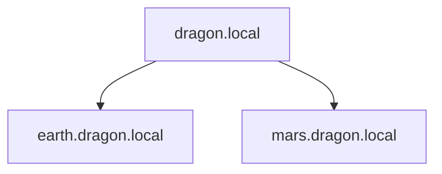
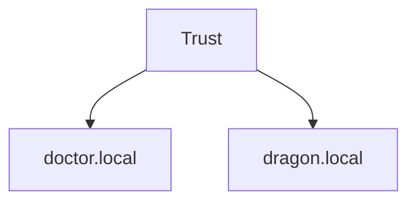

# Domain
A set of connected computers that shares and Active Directory Database. Managed by a central server or servers called Domain controller.
### Domain Name
Used to identify the domain.
Eg. `contoso.local`, `contoso.com`
[Domain Enumeration](../Domain%20Enumeration/Powershell/Domain.md)
### NetBIOS Name
Another way to identify a domain. For example net-bios name for `contoso.local` would be `CONTOSO`. 
A Domain can also be identified using domain SIDs. This is more often used by windows API rather than users.
# Trees
- Collection of domains and subdomains

- Each domain/sub-domain has their own Domain Controller

# Forests
- Collection of Domains connected via some [Trust](../Domain%20Enumeration/Powershell/Trusts.md)

- Forests are considered a security boundary, because if one domain in a forest in compromised, the entire forest in considered compromised.
# Permission Delegations
- AD Delegations are used to grans users some permission to perform tasks that require elevated permission without adding them to `DomainAdmins` or `Administrators`.
- Delegations are used to delegate some permission over an object of collections of OUs. For example: people from IT can have `PasswordReset` permission over users in Management OU.

# Global Calalog
A [global catalog (GC)](https://docs.microsoft.com/en-us/windows/win32/ad/global-catalog) is a domain controller that stores copies of ALL objects in an Active Directory forest. The GC stores a full copy of all objects in the current domain and a partial copy of objects that belong to other domains in the forest. Standard domain controllers hold a complete replica of objects belonging to its domain but not those of different domains in the forest. The GC allows both users and applications to find information about any objects in ANY domain in the forest. GC is a feature that is enabled on a domain controller and performs the following functions:

- Authentication (provided authorisation for all groups that a user account belongs to, which is included when an access token is generated)
- Object search (making the directory structure within a forest transparent, allowing a search to be carried out across all domains in a forest by providing just one attribute about an object.)