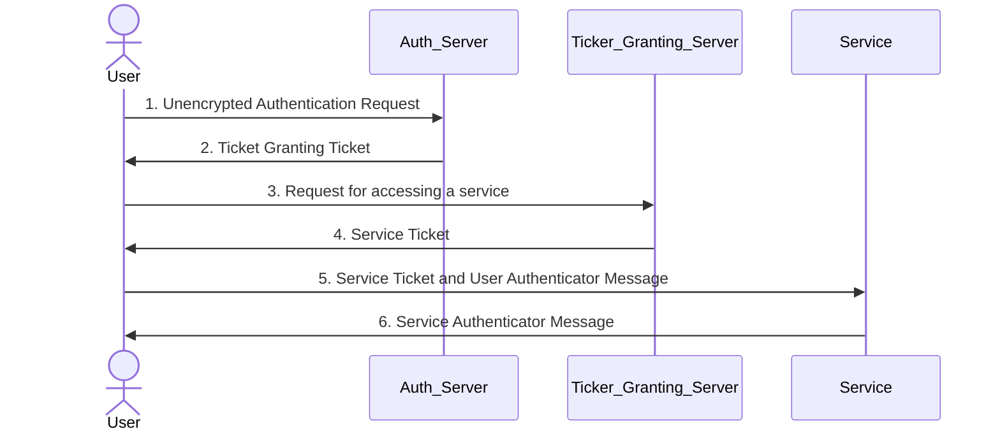

# Overview
- A Key Distribution Center(KDC) Comprises of Authentication Server and Ticket Granting Server.

# Working
### 1. User -> Auth_Server
- A user sends and Unauthenticated message to the Authentication Server with the following details:
```
[Unencrypted]
Username
ServiceName/ID
User's IP Address
Request lifetime for TGT
```
### 2. Auth_Server -> User
- The KDC has a list of tables with the username and their secret keys
```
Alice : 1c34b32g3df5
Bob : 124vcdf-2;<24
```
- The Authentication Server checks if the username sent by the User exisits and sends back two message:
- The first one is signed by the User's secret Key
```
[Encrypted:UserSecretKey]
TGS Name/ID
TimeStamp
LifeTime
<TGSSessionKey>
```
- The second one, called the TGT encrypted with the TGS's Secret Key
```
[Encrypted:TGSSecretKey]
Username/ID
TGS Name/ID
TimeStamp
Users IP Address
TGT LifeTime
<TGSSessionKey>
```
### 3. User -> TGS
- The User generates their secret key to decrypt the first message.
```
SecretKey = HASH(password+salt+version)
```
- The salt is generally `userme@realm.com`
- The hash algorithm is usually `String2Key`
- The key is then used to decrypt the first message send by the authentication server
- The User has now access to TGS ID and TGSSessionKey
- The User then generates two more messages to send to the Ticket Granting Server
- Frist one is a plain text with the follwing content
```
[Unencrypted]
ServiceName/ID
Requested Lifetime for ticket
```
- Second one is called the user authenticator and is encrypted with the TGS Session Key.
```
[Encrypted:TGSSessionKey]
Username/ID
TimeStamp
```
- The above two messages along with the TGT is sent to the TGS
### 4. TGS -> User
- TGS now has three piece of information:
- The TGT:
```
[Encrypted:TGSSecretKey]
Username/ID
TGS Name/ID
TimeStamp
Users IP Address
TGT LifeTime
<TGSSessionKey>
```
- The message:
```
[Unencrypted]
ServiceName/ID
Requested Lifetime for ticket
```
- And the User Authenticator
```
[Encrypted:TGSSessionKey]
Username/ID
TimeStamp
```
- The TGS also maintains a table with `Service` and their Secret Key
```
CRM : 1kjh24h2l35h
Finance : 12l1nkn1lk2l13l2k
Service : ljlk3h64lk4h6l3h6l
```
- The TGS looks at the unecrypted message and checks if the the ServiceName existis in its table.
- The TGS then decryptes the TGT with `TGSSecretKey` and gets access to `TGSSessionKey`
- The TGS then uses the `TGSSessionKey` to  decrypt the User Authenticator
- The TGS then start to validate the things inside the TGT and User Authenticator
- It Compares:
	- Username/ID
	- TimeStamp
	- IP Address
- And checks if the TGT has expired or not
- The TGS maintains a cache which is a list of latest Authenticator messages. It checks if the User Authenticator it just recieved is not already present in the cache to prevent a replay attack.
- The TGS then start creating it's own messages to send back to the User:
- The first message:
```
[Encrypted:TGSSessionKey]
ServiceName/ID
TimeStamp
Lifetime
<ServiceSessionKey>
```
- And the Service Ticket:
```
[Encrypted:ServiceSecretKey]
Username/ID
ServiceName/ID
TimeStamp
User ID Address
Lifetime of Service Ticket
<ServiceSessionKey>
```
- `ServiceSessionKey` is a randomly generated symetric key.
- The TGS then sends back these messages back to the User
### 5. User -> Service
- The User already has the `TGSSessionKey`. It decrypts the first message gets access to `ServiceSessionKey`
- The User creates a new authenticator message and encrypt it with the `ServiceSessionKey`:
```
[Encrypted:ServiceSessionKey]
Username/ID
Timestamp
```
- The user then forwards this new Authenticator message with the Service Ticket to the Service.
```
[Encrypted:ServiceSecretKey]
Username/ID
ServiceName/ID
TimeStamp
User ID Address
Lifetime of Service Ticket
<ServiceSessionKey>
```
### 6. Service -> User
- The Service uses it's `ServiceSecretKey` to decrypt the Service Ticket.
- The Service can now access the `ServiceSessionKey` .
- The Service the uses the `ServiceSessionKey` to decypt the User Authenticator.
- The service then perfrom checks by comparing the Username and Timestamp, and that the service ticket is not expired.
- After everything is validated the service then checks it's cache to check if the authenticator it just recivieved is not already in the service's cache. This check provides replay protection.
- The service then creates it's own authenticator message known as `service Authenticator` and send it back to the user.
```
[Encrypted:ServiceSessionKey]
ServiceName/ID
Timestamp
```
### 7. User
- The user has a copy of `ServiceSessionKey` and uses it to decrypt the `Service Authenticator`.
- The User then verifies the ServiceName, and the timestamp.