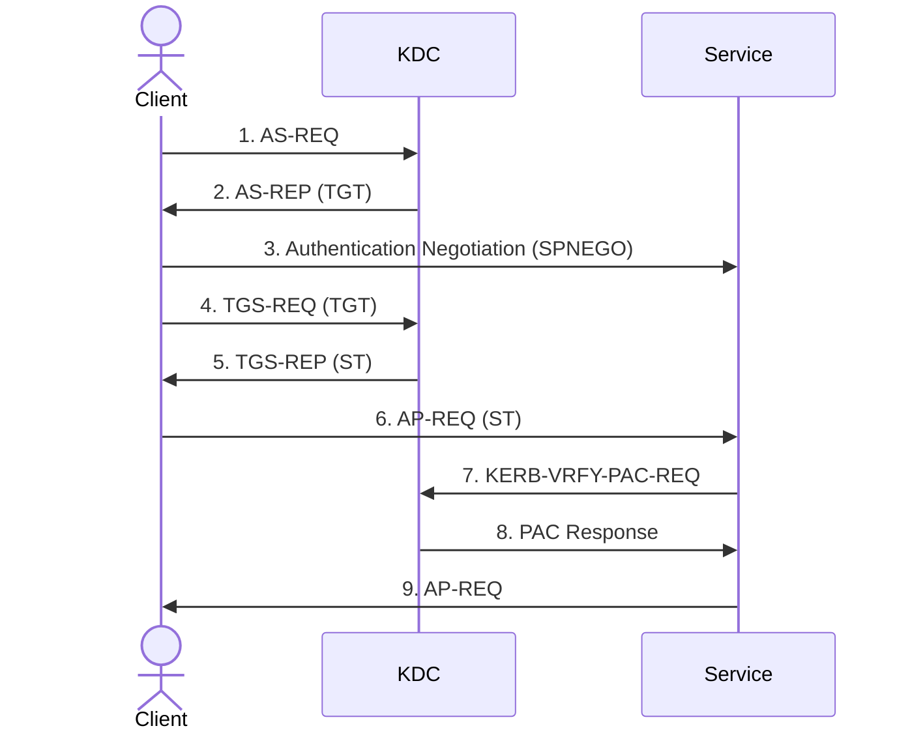

- Preferred way of authentication in active directory networks for domain control.
- Cannot be used in WORKGROUPS
- Implemented by [[Authentication#Kerberos SSP]].
- Uses [[#Tickets]] to authenticate against [[#Principals]].

# Kerberos Actors
- `Client`: Entity that receives the ticket.
- `Service`: The __Application Server__ that provides the service to the user.
- `KDC`: Key Distribution Center, the Domain Controller, responsible for creating tickets for the user (Authentication Server + Ticket Granting Server).

# Principals
- [[Active Directory/AD Concepts/Users|Users]] & [[Active Directory/AD Concepts/Services|Services]]
- To request a ticket for the service, [[Active Directory/AD Concepts/Services#SPN|SPNs]] are required.
- Principals are also used to represent the user asking for the ticket using it's `SamAccountName` using `NT-PRINCIPAL` type.S
- `NT-ENTERPRISE` is used to identify users from different domain, using `SamAccountName@DomainFQDN`.

# Tickets
- Tickets are partially encrypted data containing:
	- Target Principal - Usually a service (SPN).
	- Information about client - Name & Domain
	- Key to establish a secure connection
	- Timestamp
 
### PAC
The `Privilege Attribute Certificate` contains the authorization data.
PAC Contains:
- The Client Domain: Domain and [[SID]] of the domain.
- The Client User: Username and [[SID]] of the user.
- The Client Group: The groups and RIDs of the groups that the users belongs to.
- Other Groups: Other SIDs that references to non-domain groups. 
The PAC also contains several signatures to maintain the integrity of the PAC.
- Server Signature: Signature of the PAC content created with the key used to encrypy the ticket
- KDC Signature: A signature of the Server Signature created with the KDC key. Could be used to check that the PAC is created by the KDC and not via silver tickets. This is not checked.
- Ticket Signature: Signature of the ticket content created with the KDC key

# Types of Tickets

### Service Ticket
- The ticket that the users provides to the Service/Application Server/Principal.
- KDC issues ST to the user.
- A client can issue an ST for any service registered (via SPNs) in the Domain, as kerberos doesn't handle authorization.
- Only the principal (users/service) can read contents STs, as it includes the session key needed to establish the secure communication between the client and server. 
- STs are encrypted with key of the target principal.
- In AD, principals are usually the service. Hence the STs are encrypted with the key of the account owner of the service. (The account that registered the service via SPN).
- These [[Active Directory/AD Concepts/Users#Kerberos Keys|Kerberos Keys]] are derived from the password of these service accounts. Hence if these keys are compromised, it can be used to create ticket knows as [[Active Directory/Exploitation/Kerberos#Silver Tickets|Silver Tickets]], which can be used to access any service of that user.
- If two tickets are created for two services owned by the same user, it will be encrypted using the same key. Also, the target service (`sname`) is not the encrypted part of the ticket. Hence if we have access to one service of the user. We can change the target service of the user and access other services provided by the user. Hence if have the ticket for administrator to access MSSQL, we can change the the target to SMB (CIFS/machineName), and get administrative shell.

### Ticket Granting Ticket
- Required by the KDC to issue ST for services. Can be thought of as ST for KDC.
- As it should only be read by the principal, in this case KDC, it is encrypted by the key of `krbtgt` account which is the service account that runs the KDC (Also known as the KCD key).
- If we compromise the key or password of `krbtgt` account, we can create arbitrary TGTs for any account known as [[Active Directory/Exploitation/Kerberos#Golden Tickets|Golden Tickets]]. Golden tickets can be used to impersonate any account in the domain, including Administrators.

# Kerberos Keys
[[Active Directory/AD Concepts/Users#Kerberos Keys|Kerberos Keys]]

# Ticket Acquisition

1. `AS-REQ`: Client sends the timestamp encrypted with it's [[#Kerberos Keys]]. This is called pre-authentication, and sometimes it is not required.
2. `AS-REP`: The server responds back with two information. TGT encrypted with KDC key and client data encrypted with client key.
3. `Negotiation`: Using [[Authentication#SPNEGO]], client negotiates the authentication protocol (either NTLM or Kerberos).
4. `TGS-REQ (TGT)`: Client sends the TGT and the [[Active Directory/AD Concepts/Services#SPN|SPN]] of the target service, to the KDC and asks for the service ticket.
5. `TGS-REP (ST)`: KDC decrypts the TGT using it's key and gets access to the username and session key. KDC uses the session key to decrypt the username and verify if everything is correct. The KDC then sends two information of the client, ST of the request service, encrypted with the the key of the service user

