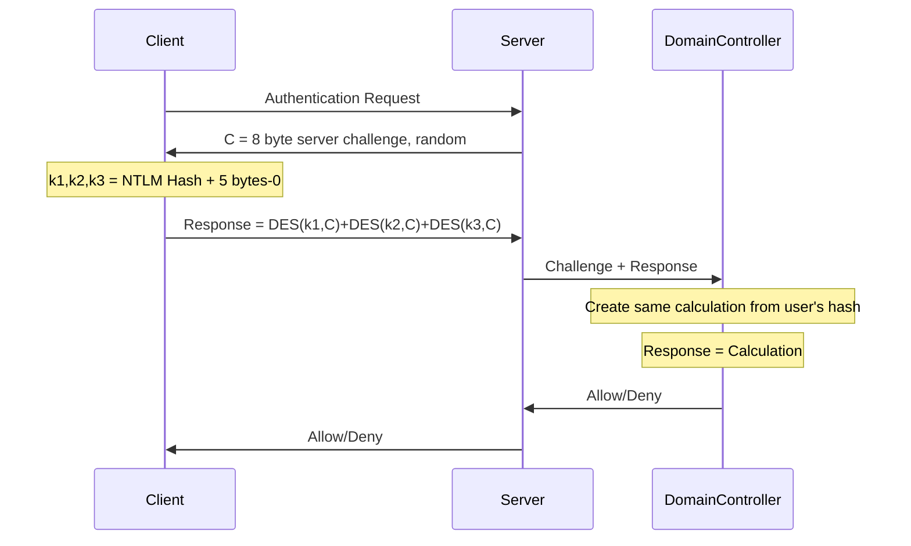

# NetNTLM v1

```mermaid
sequenceDiagram
	participant Client
	participant Server
	participant DomainController
	Client ->> Server: Authentication Request
	Server ->> Client: C = 8 byte server challenge, random
	Note over Client: k1,k2,k3 = NTLM Hash + 5 bytes-0
	Client ->> Server: Response = DES(k1,C)+DES(k2,C)+DES(k3,C)
	Server ->> DomainController: Challenge + Response
	Note over DomainController: Create same calculation from user's hash
	Note over DomainController: Response = Calculation
	DomainController ->> Server: Allow/Deny
	Server ->> Client: Allow/Deny
	
```
# NetNTML v2