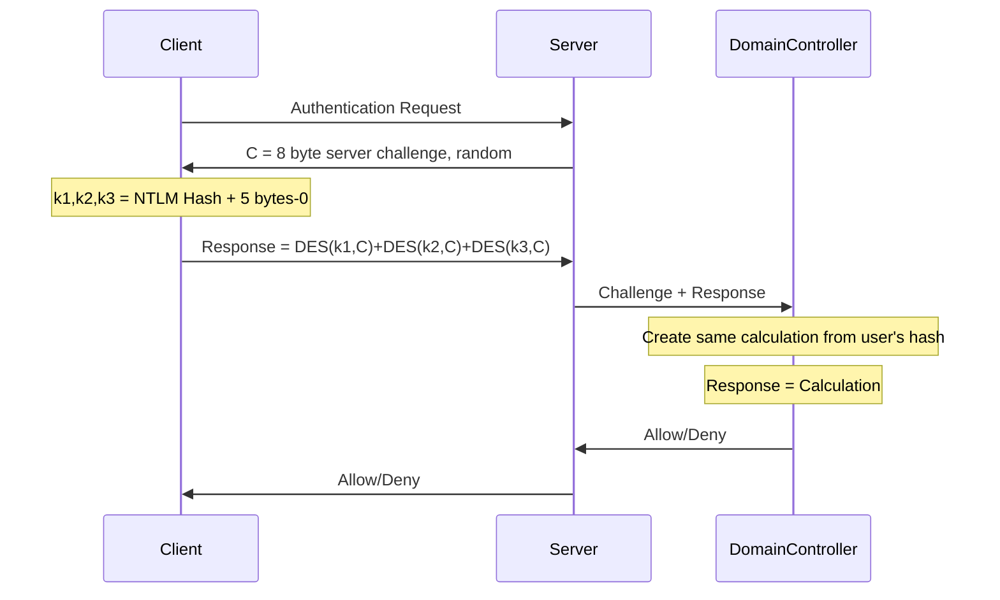

- NetNTLM or just NTLM.
### Versions
- NTLMv1: Version 1 of NTML/NetNTLM
- NTLM2: NTLMv1 with enhanced security
- NTLMv2: Better version of NTLMv1.
- NTLM does not generate network traffic on it's own. It is used by application level protocols such as SMB, LDAP etc.
- NTLM can be used by both Active Directory and Workgroups.

# Phases in NTLM
- `NEGOTIATE`
- `CHALLENGE`
- `AUTHENTICATE`
### One
- After initiating the security context using `InitializeSecurityContext` via [NTLM SSP](Authentication#NTLM%20SSP), client sends a `NEGOTIATE` message to the server, with security options and NTLM version to use.
### Two
- The server generates a security challenge by calling `AcceptSecurityContext` from [NTLM SSP](Authentication#NTLM%20SSP) and sends a challenge message back to the client with NTLM version confirmation, and information such as computer name, version and the domain name. 
### Three
- The client receives the challenge from the server and passes it back to `InitializeSecurityContext` to calculate a response using the user's password (NT Hash)
- Client creates a `session key` and encrypts it with another key knows as `session base key` derived from NT Hash of the user.
- Client sends the response and session key back to the server.
- More information such as `av_pairs`, like information about the computer name, version, domain etc, is also sent, along with MIC (Message Integrity Code).
### Four
- The server verifies the the challenge response using `AcceptSecurityContext` and a security context is setup. The message now will be encrypted with the session key.

> Note that the server never sends the NT Hash of the user but is only used to calculate the NTLM response and the session key.
> And the NTLM response is also knows as the NTLM Hash (NetNTLM Hash) and it depends on the version of NTLM Protocol.

### NTLMv1 (NetNTLMv1)
- In NTLMv1, the NTLM response to the challenge is calculated by encrypting the challenge with user's NT Hash using DES algorithm.
- The session key is also encrypted using the DES algorithm.

### NTLMv2 (NetNTLMv2)
- NTLMv2 also protects the integrity of the `AUTHENTICATE` message by taking into account, other parameters such as:
	- Server Challenge
	- Randomly generated client challenge
	- Timestamp
	- AvPairs field that contains information such as server/domain name, MIC

Hence, the integrity of the 3 messages is preserved. And, in case of the attacker removes the MIC, the authentication will fail, since the NTLMv2 response protects the flag that indicates that MIC is present. Nevertheless, in the past, the MIC has been the target of various investigations that discovered the [_Drop the MIC_](https://www.preempt.com/blog/cve-2019-1040-windows-vulnerability/) and [_Drop the MIC 2_](https://www.preempt.com/blog/active-directory-ntlm-attacks/) vulnerabilities.

It must be noted, that NTLMv1 doesn't take into account the NTLM flags to create the response. Therefore, in case of using NTLMv1, an attacker performing a [NTLM Relay](https://zer1t0.gitlab.io/posts/attacking_ad/#ntlm-relay) attack can just remove the MIC (and adjust the flags shown in [_Drop the MIC_](https://www.preempt.com/blog/cve-2019-1040-windows-vulnerability/)) of the AUTHENTICATE message to tamper the data and, for instance, disabling the signing of application messages.

# NTLM in AD
- NTLM can be used in both workgroup and Active Directory.
- In case of Active Directory, the target machine will send a `NetLogon` (NetrLogonSamLogonWithFlags) to the domain controler asking it to verify the client's response with the the challenge
- The domain controller will verify the challenge and the client response and return the session key and the user privilege.
### NTLMv1 flow in AD

