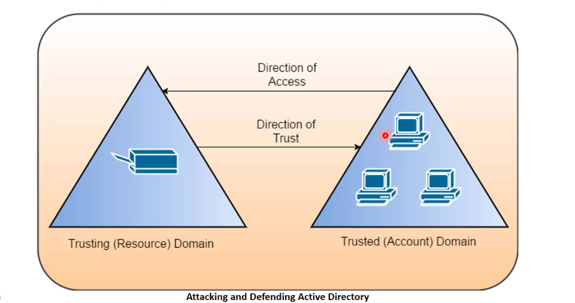
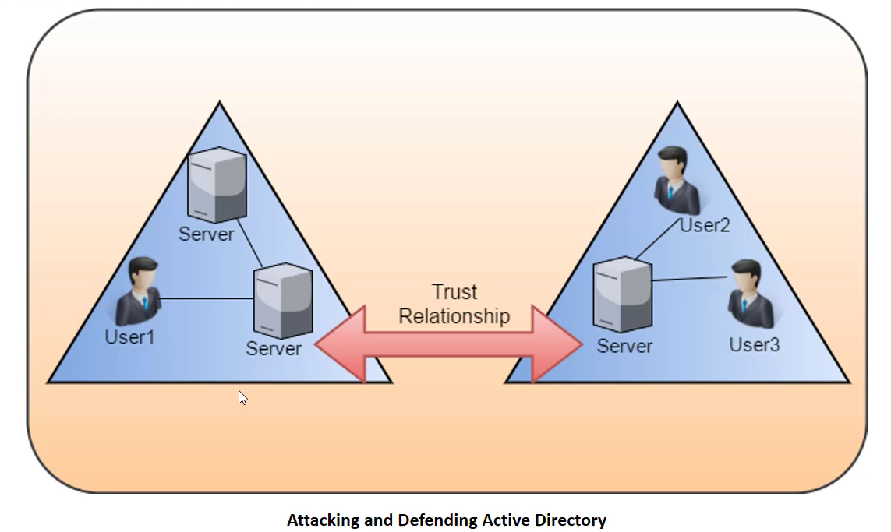
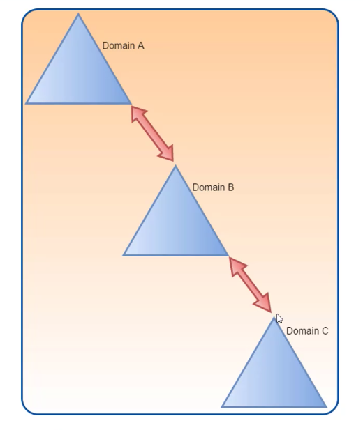
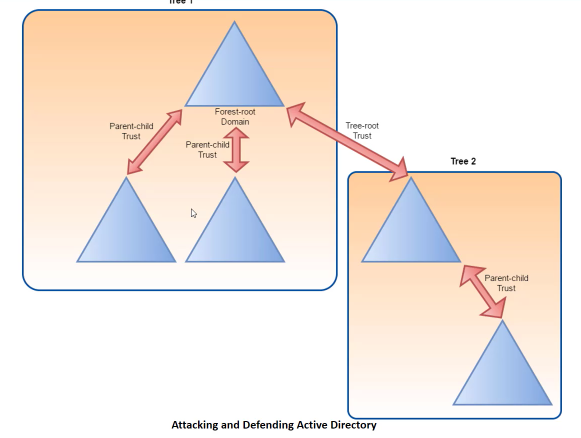
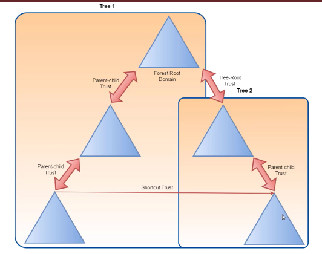
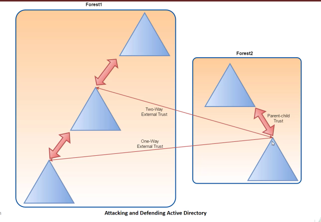

# Trusts
- A relationship between two or more trees or forest or domains.
### Trust Types
- Parent-Child: default trust when child domain is created.
- Forest: Trust to share resources in a forest.
- External: Trust to connect to a specific domain that is not trusted forest.
- Realm: Connects AD with non windows domain.
- Shortcut: When two domains are not directly connected. Avoids jumping over many trusts by creating shortcut trusts.
In AD environment, Trust is a relationship between two domain or forest which allow users of one domain or forest to access resources in other domain for forest.

Trust can be automatic (parent-child, same forest etc) or established (forest, external).

Trusted Domain Objects (TDOs) represent the trust relationship in a domain.

### Trust Direction
1. One Way Trust : Unidirectional. Users in the trusted domain can access resources in the trusting domain but reverse is not true. 
3. Two Way Trust: Bi-directional. Users of both domains and access resources in the other domain. 
### Trust Transitivity
1. Transitive : Can be extended to establish trust relationship with other domains. All the default intra-forest trust relationship ( Tree root, parent child ) between domains within the same forest are transitive two way trust. 
2. Non Transitive Trust: Cannot be extended to other domains in the forest . Can be two-way or one-way. This is the default trust (called external trust) between two different domain in two different forest when forest don't have a trust relationship.

## Types of Trust
### Default/Automatic Trust
- Parent-Child Trust : It is created automatically between the new domain and the domain that precedes it in the namespace hierarchy, whenever a new domain is added in a tree. For example `subdomain.domain.local` in a child of `domain.local`. This trust is always two way transitive.
- Tree-Root Trust: It is created automatically between whenever a new domain tree is added to a forest root. This trust is always two-way transitive.
- 
### Shortcut Trust
- Used to reduce access times in complex trust scenario.
- Can be one-way or two-way transitive.
- Reduce hops

### External Trust 
- Between two domain in different forets when forests do not have a trust relationship 
- Can be one-way or two-way and is non-transitive
- 
### Forest Trusts
- Between forest root domain.
- Cannot be extended to a third forest (No implicit trust)
- Can be one-way or two-way and transitive and non-transitive
### Trust Key
When trust is created, a trust key is made to keep the connection secure. A trust account is created in the domain database, similar to a user account(ends with `$`) and the trust key is stored as the password of this user.

[Trusts Enumeration](../Domain%20Enumeration/Powershell/Trusts.md)