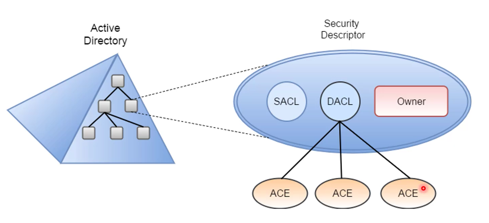

Enables Control on the ability of a process to access object and other resource in active directory based on:
* Access Token (security context of a process - Identity and Privilege of a user)
* Security Discriptors (SID of the owner, Discretionary ACL(DACL) and System ACL(SACL). Both DACL and SACL had entries called Access Control Entities (ACEs))

### ACL (Access Control List)
It is a list of Access Control Entities (ACE) - ACE corresponds to individual permission or audit access. Who has permission and what can be done on an object.
	Types of ACL:
* DACL: Define a permission trustees (a user or a group) have on an object.
* SACL: Logs success and failure audit messages when an object is accessed.

### ADModule
```powershell
# Get ACL without resolving GUIDs
(Get-Acl 'AD:\CN=Administrator,CN=Users,DC=Dollarcorp,DC=Moneycorp,DC=Local').Access
```
### Powerview
```powershell
# Get ACL Accociated with a specific object
Get-DomainObjectAcl -SamAccountName student1 -ResolveGUIDs

# Get ACL accociated with the specific prefix to be used for search (search by Distinguished name)
Get-DomainObjectAcl -ADSprefix 'CN=Administrator,CN=Users' -Verbose

# Get ACL for ldap path
Get-DomainObjectAcl -SearchBase "LDAP://CN=Domain..." -ResolveGUIDs -Verbose

# Search for interesting ACEs
Get-PathAcl -Path "\\dcorp-dc.dolarcorp.local/SYSVOL"

# find interesting ACLs
Find-InterestingDomainAcl -ResolveGUIDs

# Find intersting ACLs for a specific user
Find-InterestingDomainAcl -ResolveGUIDs | ?{$_.IdentityReferenceName -match "username"}
```