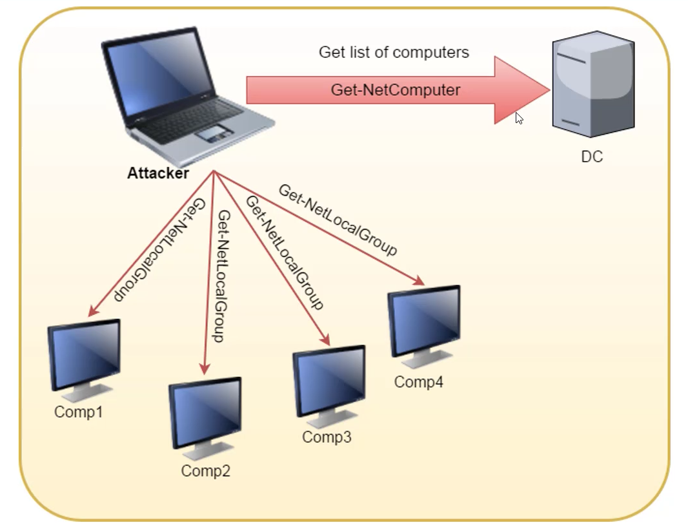

### Powerview
- Find all the machine on the current domain where the current user has local admin access.
```powershell
# This function queries the DC of the current or provided domain for a list of computers (Get-NetComputer) and then use multi-threaded Invoke-CheckLocalADminAcess on each machine.
Find-LocalAdminAcess -Verbose
# The function leaves a 4624 logon and 4634 logoff event on each and every machine.

# Same can by done by help of remote administration tools like WMI and powershell remoting. Pretty Usefull in cases ports (RPC and SMB) used by Find-LocalAdminAccess are blocked
Find-WMILocalAdminAccess.ps1
Find-PowershellLocalAdminAccess.ps1
# As both WMI and Powershell remoting requires local admin access, if we are able to connect to the machines, we have admin access on the machine
```
- Find local admins on all machine of the domain (needs administrator privs on non-dc machines. 
```powershell
Invoke-EnumerateLocalAdmin -Verbose
```
- Find computers where a domain admin (or specified user/group) has session:
```powershell
Find-DomainUserLocation
Find-DomainUserLocation -UserGroupIdentity "RDPUsers"
# This function queries the DC of the curnt or provided domain for members of the given group (Domain Admins by default) using Get-DomainGroupMember, gets a lsit of NetSEssion/Get-NetLoggedon from each machine

# To confirm Admin Access
Invoke-UserHunter -CheckAccess

# STEALTH MODE
Invoke-UserHunter -Stealth
# This option queries the DC of the current or provided domain for members of the given group (Domain Admins by default) using get-netGroupMembers, gets a list of ONLY high traffic servers (DC, File Servers and Distrbuted File Servers) for less traffic generation and list sessions and logged on users (GetNetSessoiin/GetNetLoggedon) for each machine.

# SessionHunter
# Doesn't require local admin privilege on the remote machine
Invoke-SessionHunter
```