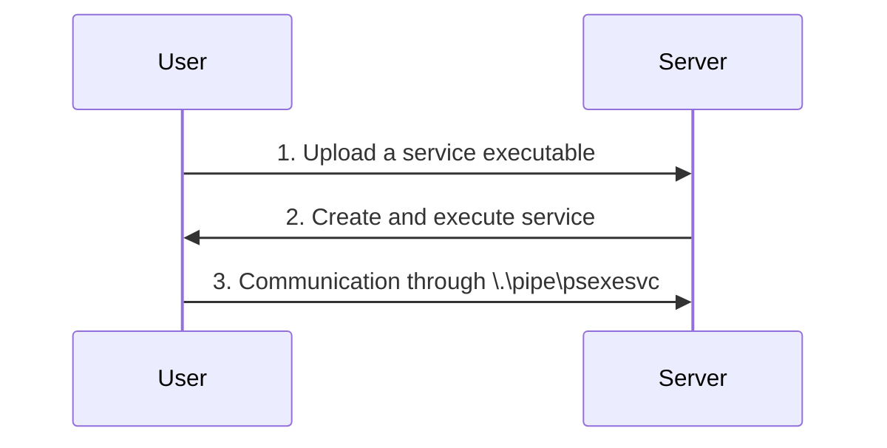

#psexec #impacket 
# PSexec
- Ports: 445/TCP (SMB)
- Group: Administrators
1. Connects to Admin$ Share and uploads a service binary. PSexec uses `psexesvc.exe` 
2. Connect to the service control manager to create and run a service named PSEXESVC and associate the service binary with `C:\Windows\psexesvc.exe`.
3. Create some named pipes to handle stdin/stdout/stderr.


```powershell
# Sysinternal's PSExec
.\psexec64.exe \\<server> -u <username> -p <password> -i cmd.exe

# Impacket's PSexec
psexec.py <Username>@<server> cmd.exe
```
More about psexec [here](https://www.rapid7.com/blog/post/2013/03/09/psexec-demystified/)
