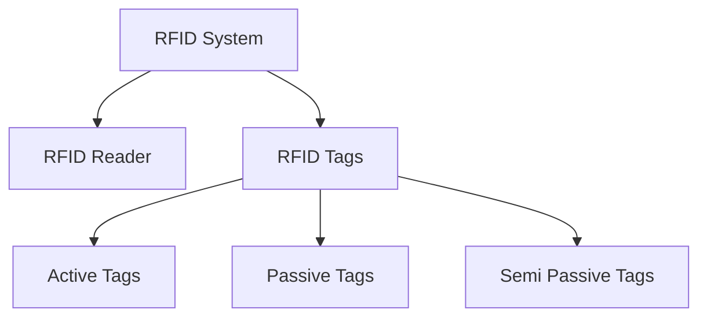
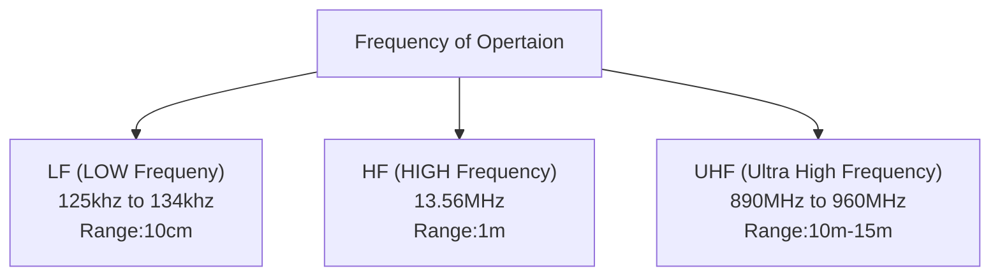

# Basics
- Radio Frequency Identification

### Active Tags
- Have their own power suply
- Are bulky
### Passive Tags
- Relies on the radio frequeny from the RFID reader to generate power using electromagnetic coupling to transmit the feedback signal.
- Range is less
- More prominent
### Semi Passive Tags
- Have their own power suply.
- For sending the feedback signal, they rely on radio frequency from the RFID tags.

