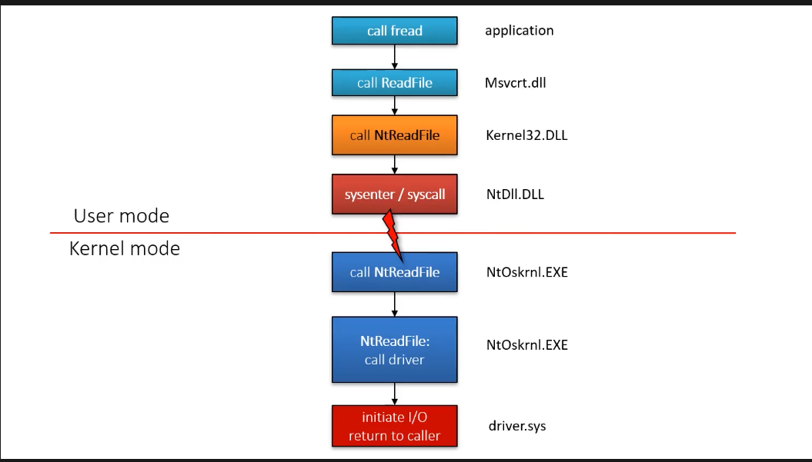
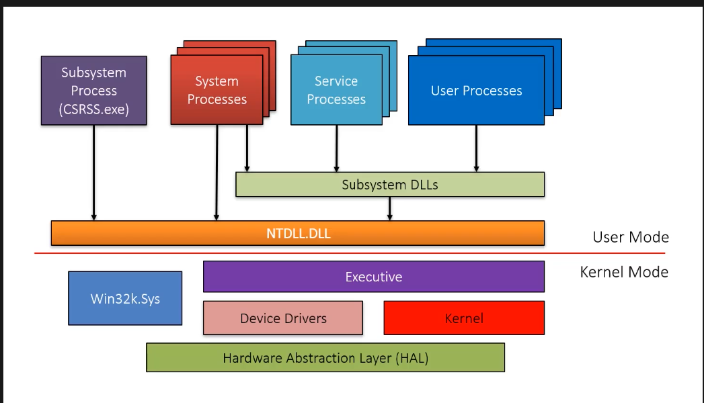

# Processes
- A set of resources used to execute a program.
- Are isolated from one another.
- Consists of:
	- A private virtual address space
	- Image of the executable program, contains the initial code to be executed
	- A private table containing the handle of the kernel objects
	- Access token - Security context - the context in which the process is running. Used to check of the process has permission over a resource
	- Threads - one or more threads to execute the program. First thread is created when the process is started.
* Some properties of process that we can find in task manager:
	* `Name`: the executable that is run by the process.
	* `PID`: Process ID, unique identified for the process.
	* `Status`: Current status of the process:
		* Running: Is consuming data coming from the message queue and processing it.
		* Suspended: The program doesn't look at it's message queue for at least 5 seconds.
	* `Users`: The owner of the process. 
	* `Session`: 0 is for process run by the system (services and system processes).
	* `Memory (active private working set)`: Amount of private memory that the process is using. 
	* `Commit Size`: The actual amount of private memory allocated for the process.
	* `Handle`: The number of handle the process currently has.
	* `Threads`: Number of threads executing the code.
	* `Platform`: Tells if the process is 64 bit or 32 bit.
# Virtual Memory
-  Every process has virtual address space.
- Process sees a flat linear memory assigned to it, but the virtual memory is mapped to different places in physical memory or on disk (This is taken care by memory manager).
-  Memory is managed in chunks called pages:
	- Default size of 4kb
- Processes access the memory irrespective of where it resides. 
	- Memory managed handles mapping of virtual memory to physical pages
	- Process doesn't need to know the actual physical address of a given address in virtual memory.
## Virtual Memory Layout
### 32 Bit
- Each process gets a potential User Process Space of 2 gigs that it can use. This is relative as each process gets its own private space.
- `User Process Space`: 00000000 to 80000000 - 2GB
- The other 2 gigs in a 32 bit computer is allocated to System Space where all the kernel, device drivers are loaded. As there is only one kernel, there is only one instance of this space
- `System Space`: 8000000 - FFFFFFFF - 2 GB
### 64 Bit
- Each process get a potential User Process space of 128 TB. This is relative as each process gets its own private space.
- `User Process Space` : 000000000000 - 7FFFFFFFFFFF - 128 TB
- Another absolute space is used by System Space with is also 128 TB, used by kernel, device drivers etc. As there is only one kernel, there is only instance of this space.
- `System Space`: FFF800000000000 - FFFFFFFFFFFFFFF: 128 TB
- The actual memory size that a register in 64 bit CPU can refer is in exabytes, but is not possible today. Hence most of the address space is left as it is or unmapped.

In 64 bit version of windows 8 and earlier, only 8 TB of user and kernel space was used.

# Dynamic Link Libraries (DLLs)
- Loadable modules, mapped into a process address space
- Contains:
	- Code
	- Data
	- Resource
- Can be shared between processes. Process A can point to a certain location in memory in RAM where the DLL is present, and another process B can also point to the same location in memory to access the same DLL. It will very expensive, to copy the DLL for every process.
- Many DLLs are provided with windows by default.

# Threads
- Entity that is schedule by the kernel to execute code on the processor 
- A thread contains:
	- State of CPU registers
	- Current access mode (user mode or kernel mode)
	- Each user mode has two stacks - One in user space and one in kernel space
	- Thread Local Storage (TLS) - User mode mechanism to store data on per thread basis.
	- Access Token (Optional) - by default, thread use default access token of the user, but sometimes the process needs to impersonate someone. 
	- Message queue and Windows (Optional) - Usually a thread is a CPU thread or an IO thread. But if the process creates a windows, the thread handling the window automatically gets a message queue. The thread sends data of everything happening on the window
	- Priority - A number between 0 and 31. Specifies the priority of the thread.
	- State:
		- Running - Thread is currently executing.
		- Ready - Wants to execute code but CPU is busy running other threads.
		- Waiting - Thread doesn't want to execute, as it is waiting for some data or IO processing to complete.
# System Architecture


# Windows Subsystem APIs
### Windows API
- Also called Win32 API
	- Classic C APIs from the initial day of windows NT.
- Some APIs are COM (Component Object Model)
### .NET
- Managed libraries running on top of the CLR
- Common language: C#, VB.NET, F#, C++, CLI, Powershell
### Windows Runtime (WinRT)
- New unmanaged API available from Windows 8.
- Built on top of enhanced version of COM.
# Windows API/Win32 API
### Getting System Information
```c
#include <stdio.h>
#include <Windows.h>
#include <stdlib.h>

int main() {
    SYSTEM_INFO *systeminfo = (SYSTEM_INFO *)malloc(sizeof(SYSTEM_INFO));
    GetNativeSystemInfo(systeminfo);
    printf("Processor Type: %d\n",systeminfo->dwProcessorType);
    printf("Number of Processors: %d\n",systeminfo->dwNumberOfProcessors);
    printf("Page size: %d\n",systeminfo->dwPageSize);
}
```
```rust
use windows::Win32::System::SystemInformation::{self, GetNativeSystemInfo, SYSTEM_INFO};
fn main() {
    let mut sysinfo: SYSTEM_INFO = SYSTEM_INFO::default(); // initializing the default value of SYSTEM_INFO
    unsafe { // using unsafe as GetNativeSystemInfo is an unsafe function
        GetNativeSystemInfo(&mut sysinfo as *mut SYSTEM_INFO); // using raw pointers as this API uses the raw pointer
    }
    println!("Number of Processor: {}", sysinfo.dwNumberOfProcessors);
    println!("Processor Type: {}", sysinfo.dwProcessorType);
    println!("Page size: {} bytes", sysinfo.dwPageSize);

}
```
- Output
```
Processor Type: 8664
Number of Processors: 4
Page size: 4096
```
### Handling Errors
`GetLastError` can be used to get error code encountered in the last function. `FormatMessage` can be used for format the error message to get the textual description.
```c
void errorhandling(){
    DWORD errchar; // for storing error code
    WCHAR errormsg[512]; // buffer for storing error message
    HANDLE process = OpenProcess(
        PROCESS_TERMINATE, // asking terminal permission for the process
        FALSE,
        468 // process ID
    );
    if(process) { // handle will be NULL or 0 if access is denied
        TerminateProcess(
            process, // handle to process
            0 // exit code
        );
    } else {
        DWORD errorcode = GetLastError(); // get error code
        printf("Error Code: %u\n",errorcode);
        FormatMessageW(
            FORMAT_MESSAGE_FROM_SYSTEM, // flags for the error
            NULL,
            errorcode, // error code
            0,
            errormsg, // buffer for error message
            512,
            NULL);
        printf("Error Message: %ws\n",errormsg);
    }
}
```
### Strings
- Windows uses UTF-16 to represent strings, which is 2 bytes per character.
- Sometimes also known as Unicode.
- Windows API also makes use of Unicode strings. For compatibility reasons, ANSI (ASCII) versions of the API call is also available.
        - Functions ending with "W" represents Unicode version.
        - Functions ending with "A" represents ANSI version.
        - Function not having "A" or "W" is really a macro to either A or W version, depending on the machine and compiler. This is usually W for modern systems.
- Types available:
        - *WCHAR*, which a typedef to *wchar_t*, also knows as wide char, represents UNICODE charachters - 2 Bytes.
        - *PWSTR* - Pointer to wide string (Unicode String Pointer), *PSTR* - Pointer to ASCII characters (ASCII String Pointer)
        - *PCWSTR* - Pointer to constant wide string, *PCSTR* - Pointer to constant ascii string.
        - Unicode Literal : L"Doctor" - Uses 2 bytes per character.
- String manipulation:
        - Classic S functions for string manipulation is unsafe.
                - Eg: strcpy(ascii) , wcscpy(unicode), strcat etc.
        - Safe versions:
                - strcpy_s()
                - wcscpy_s()
        - Other safe versions, included in <strsafe.h>:
                - StringCchCopy
                - StringCchCat
                - StringCchPrintf
                - Have A and W version.
- Some miscellaneous functions:
```c
void stringsfunctions() {
    // get system directory path API.
    WCHAR systemdirectory[MAX_PATH];
    GetSystemDirectoryW(
        systemdirectory, // buffer to store systemdirecotry information
        _countof(systemdirectory) // length so that the function cannot overflow the buffer
    );
    printf("System Directory %ws\n",systemdirectory);

    // get computer name API
    WCHAR computername[MAX_COMPUTERNAME_LENGTH];
    DWORD len = _countof(computername); // _countof counts the element in a buffer
    BOOL res = GetComputerNameW( // returns BOOL
        computername, // computer name buffer
        &len // LPDWORD nSize, which is a long pointer to a DWORD.
        // this type of parameter is called in-out parameter.
        // IN: len specifies the length to fill in the buffer.
        // OUT: the function then writes the length actually filled by the function.
    );
    if (res) {
        printf("Computer Name(%d): %ws\n",len,computername);
    }
}
```
### Structures
- Most structures in the windows API are defined like:
```c
typedef struct _SOME_STRUCT {
        // fields
} SOME_STRUCT, *PSOME_STRUCT, *LPSOMESTRUCT;
```
- The long prefix is there for historic reasons. There is no long pointer as such. Pointers have defined size:
        - 4 bytes for 32 bit processor
        - 8 bytes for 64 bit processor
- Some structures have version, and the version depends on the size of the structure. The size of the structure is defined by the first member.
```c
void structures() {
    SHELLEXECUTEINFOW shell; // a shell execute structure
    memset( // used to null out any data structure
        &shell, // pointer to the structure
        NULL, // value to fill the strcutre with
        sizeof(shell) // size of the structure
    );
    shell.cbSize = sizeof(shell); // setting the first member cbSize to the size of the structure

    // another way to zero out a structure
    SHELLEXECUTEINFOW shell2 = { sizeof(shell2) }; // this will set the first member to the size of the structure and zero out the rest

    // settings the fields
    shell.lpFile = L"c:\\windows\\win.ini"; // file to open
    shell.lpVerb = L"open"; // action to perform
    shell.nShow = SW_SHOWNORMAL; // display the window normally
    ShellExecuteExW(&shell);
}
```
### Windows Version
- Windows Numeric Version:
        - Windows NT (4.0)
        - Windows 2000 (5.0)
        - Windows XP (5.1)
        - Windows Server 2003, 2003 R2 (5.2)
        - Windows Vista, Server 2008 (6.0)
        - Windows 7, Server 2008 (6.1)
        - Windows 8, Server 2012 (6.2)
        - Windows 8.1, Server 2012 R2 (6.3)
        - Windows 10, Server 2016 (10)
- `GetVersionEx()` function was used traditionally to get the version information, but is now deprecated.
- New helper functions defined in `versionhelpers.h` is used now:
        - `IsWindowsXPSP3OrGreater()`
        - `IsWindows10OrGreater()`
        - `IsWindowsServer()`
- These functions are implemented with `VerifyVersionInfo()`
- It requires manifest file to get correct information
```c
void winversion() {
    // deprecated but can be enabled with macro
    OSVERSIONINFO vi = { sizeof(vi) };
    GetVersionEx(&vi);
    printf("%u.%u.%u\n", vi.dwMajorVersion, vi.dwMajorVersion, vi.dwBuildNumber);
    BOOL ans;
    if (ans = IsWindows7OrGreater()) {
        printf("7 and greater");
    }
}
```
### System Information
- `GetNativeSysteminfo()` & `GetSysteminfo()` can be used to query information about the operating system and architecture.
- `GetPerformanceInformation()` from `psapi.h` can be used to get information about processes and threads
```c
void moresysteminfo() {
    PERFORMANCE_INFORMATION pi; // perfomance information object
    for (;K32GetPerformanceInfo(&pi, sizeof(pi));) { // infinite loop that updates the pi object
        printf("Process: %u\n",pi.ProcessCount);
        printf("Thread: %u", pi.ThreadCount);
        printf("\r\x1b[2A");
        // \r: return cariage: moves the cursor to the begining of the line
        // \x1b: ESC: Suggests start of an escape sequence
		// [2A: moves the cursor 2 lines up
        Sleep(1000);
    }
}
```
# Objects & Handles
### Kernel Objects
- Windows is object oriented operating system.
- Exposes objects like:
	- Process
	- Threads
	- Mutex
	- Semaphores
	- Files
	- Directories
- Data structure for these objects are present in system space, and is inaccessible in user mode. Kernel mode can access these objects directly.
- Kernel objects are reference counted. Once all handle to an object is closed, object is destroyed.
- Users from user mode can only obtain handle to an object.
### Handles
- Process maintains a private handle table.
- When a process creates an object, it receives a handle to the object, which is an indirect pointer to an object instance.
	- Used as a way to access the underlying object.
	- Can be used to share objects across processes.
- Process Explorer can be used to see handles opened by a process.
- Handles are always represented as a multiple of 4.
- Objects exposed by the Windows API for the user-mode:
	- Process
		- `CreateProcess()`
		- `OpenProcess()`
	- Threads
		- `CreateThread()`
		- `OpenThread()`
	- Jobs
		- `CreateJobObject()`
		- `OpenJobObject()`
	- Files
		- `CreateFile()`
		- `CreateFile2()`
	- File Mapping (Section)
		- `CreateFileMapping()`
		- `OpenFileMapping()`
	- Token
		- `LogonUser()`
		- `OpenProcessToken()`
	- Mutex (Mutant)
		- `CreateMutex[Ex]()`
		- `OpenMutex()`
	- Event
		- `CreateEvent[Ex]()`
		- `OpenEvent()`
	- Semaphore
		- `CreateSemaphore()`
		- `OpenSemaphore()`
	- Timer
		- `CreateWritableTimer()`
		- `OpenWritableTimer()`
	- I/O Completion Port
		- `CreateIOCompletionPort()`
	- Window Station
		- `CreateWindowStation()`
		- `OpenWindowStation()`
	- Desktop
		- `CreateDesktop()`
		- `OpenDesktop`
- These functions return a HANDLE to the object created or opened.
- If the functions fail, it returns `NULL` or `INVALID_HANDLE_VALUE`
- After use, handle should be closed using `CloseHandle()`, which will delete the handle from the handle table and decrement the reference count of the object by one. (If reference count becomes 0, the object is deleted)
```c
void handles() {
	// create event
	HANDLE evnt = CreateEventW(NULL, TRUE, FALSE, NULL);
	if (evnt) {
		SetEvent(evnt);
		CloseHandle(evnt);
	}
	else {
		printf("Failed to create event %u\n", GetLastError());
	}

}
```
### Pseudo Handles
- A normal handle is always multiple of four. First handle value is 4.
- Pseudo Handles have special value, and are not closable
	- Handle returned by `GetCurrentProcess()` returns `-1` and is handle to the current process
	- Handle returned by `GetCurrentThread()` returns `-2` and is handle to the current thread
	- Handle returned by `GetCurrentProcessToken()` returns `-4`  which is handle to current process's token object.
	- Handle returned by `GetCurrentThreadToken()` returns `-5`  which is handle to current thread's token object.
	- Handle returned by `GetCurrentThreadEffectiveToken()` returns `-6` which is handle to current's thread's token if it's impersonating.
	- All tokens have `TOKEN_QUERY` and `TOKEN_QUERY_SOURCE` rights only.
```c
void pseudoHandles() {
	HANDLE prcshndl = GetCurrentProcess();
	HANDLE thrdhndl = GetCurrentThread();
	HANDLE prcstknhndl = GetCurrentProcessToken();
	HANDLE thrdtknhndl = GetCurrentThreadToken();
	HANDLE thrdefftknhndl = GetCurrentThreadEffectiveToken();
	printf("Process Handle: %d\n", (int)prcshndl);
	printf("Thread Handle: %d\n", (int)thrdhndl);
	printf("Process Token Handle: %d\n", (int)prcstknhndl);
	printf("Thread Token Handle: %d\n", (int)thrdtknhndl);
	printf("Thread Effective Token Handle: %d\n", (int)thrdefftknhndl);

}
```
```
Process Handle: -1
Thread Handle: -2
Process Token Handle: -4
Thread Token Handle: -5
Thread Effective Token Handle: -6
```
- Use Case: `SetPriority()` function can be used to set priority of a process, and required handle to a process, so a handle to our own process can be supplied to the function to change the priority of our process.
```c
void changepriority() {
	SetPriorityClass(
		GetCurrentProcess(), // handle to current process
		HIGH_PRIORITY_CLASS // priority class
	);
}
```
### Sharing Objects
- Objects created can be shared by other processes.
- This can be done my:
	- Process handle inheritance: A child process gets access to some handles of the parent process
	- Creating/Opening objects by name.
	- Duplicating a handle: difficult in practice.
##### 1. Object Names
- Allows object lookup by name.
- Can be shared easily within process.
- Not all objects can have name. 
- Named objects are stored in the `object manager namespace`
```c
void sharingmutex() {
	HANDLE mtx = CreateMutexW(NULL,FALSE, L"mymtx");
	printf("Handle created\n");
	if (!mtx) {
		printf("Error Creating Mutex\n");
	}
	printf("Last Error: %u\n", GetLastError());
	Sleep(INFINITE);
}
```
- If the above code runs more than once, the `Create*()`  returns the handle to the same object, but also generates an error with error code 183, which is `ERROR_ALREADY_EXISTS`
- Output #1: First Instance
```c
Handle created
Last Error: 0
```
- Output #2: Second Instance
```c
Handle created
Last Error: 183
```
- Both these handle with point to the same object.
- Programs that wants to force a single will create a named object and check for it's existence. If the named object exists, they terminate and move the focus on the original instance.
### Object Names & Sessions
- Each session object should have it's own objects.
- The object manager creates a session directory with a session ID subdirectory, in which the named objects are created. Session can be:
	- `0`: Session 0 is used by services and user-mode drivers
	- `1`: Session 1 is used by user programs
- WinObj from SysInternals can be used to analyze object manager.
- An object created in session 1 will reside in `\Session\1\BaseNamedObjects\mynamedobject`
- Session 0 objects are stored in the root `\BaseNamedObjects\`
- If a user wants to access object in session 0, it can be done by prefixing the named object with `Global\`
- This to note about standard named objects are they are visible. They can be viewed by sysinternal tools such as `Process Explorer`. Private Object Namespace can be used to hide objects.
### Private Object Namespace
- This is used to make the objects invisible.
- Access can be restricted using Integrity levels or SIDs.
- APIs:
	- `CreateBoundaryDescriptor()`
	- `AddSIDToBoundaryDescriptor()`
	- `CreatePrivateNamespace()`
	- `OpenPrivateNamespace()`
	- `ClosePrivateNamespace()`
```c
void privatenamespace() {
	// creating the boundary descriptor
	HANDLE hBoundary = CreateBoundaryDescriptorW(
		L"MyDescriptor", // descriptor name
		NULL
		);
	if (!hBoundary)
		printf("Error Creating Boundary\n");
	HANDLE hNamespace = CreatePrivateNamespaceW(
		NULL,
		hBoundary, // boundary descriptor
		PRIVATE_NAMESPACE // private namespace name
		);
	if (!hNamespace) { // in case it is already present, open the private namespace
		hNamespace = OpenPrivateNamespaceW(
			hBoundary,
			PRIVATE_NAMESPACE
		);
	}

	// creating an object in the private namespace
	HANDLE hmutex = CreateMutexW(NULL, FALSE, PRIVATE_NAMESPACE L"\\mymtx");
	Sleep(INFINITE);
}
```
- If process is inspected using process explorer, the object will be displayed as `\...\mymtx` so the namespace of the object is indecipherable/invisible by the inspector. A user mode process can never open handle to this object if they don't know the private namespace name or don't have access to it.
##### 2. Handle Inheritance
- Way to share objects.
- Handles can be copied to a new child process.
- Handles that should be inherited by the child process should be marked `INHERITABLE`.
- The `CreateProcess()` call must specify TRUE for inherit handle parameter.
- All the inherited handles are duplicated with the the same handles values.
```c
void handleinherit() {
    HANDLE hndl = CreateEventW(NULL, TRUE, FALSE, L"MyHandle"); // creating an event object
    printf("Handle: 0x%p\n", hndl);

    SetHandleInformation( // to mark handle as INHERITABLE
        hndl, // handle to event object
        HANDLE_FLAG_INHERIT, // flag to change
        HANDLE_FLAG_INHERIT // flag to change it with
    );

    // creating a process
    PROCESS_INFORMATION pi; // create process will fill this object with the process ID and other details such as thread ID and process ID
    STARTUPINFOW si = { sizeof(si) };
    wchar_t cmdline[] = L"notepad";

    if (CreateProcessW(NULL, cmdline, NULL, NULL, TRUE, 0, NULL, NULL, &si, &pi)) {
        printf("Process ID: %u\n", pi.dwProcessId);
        CloseHandle(pi.hProcess);
        CloseHandle(pi.hThread);
    }
}
```
- After this code, both the program and notepad will have the event handle with the same handle ID pointing to the same resource in memory.
- The handle ID from the parent process can be copied over the child process by passing the handle value as command line argument to the child process. The child process must now handle the argument to get the handle value and cast it as void pointer to be able to use the event.
```c
whcar_t cmdline[] = L"notepad {}" // replace {} with handle ID. In this case notepad's default behavious is to open the file.
```
##### 3. Duplicating Handles
- Most generic mechanism to create a copy of a handle.
- Works for any kind of object
- The API `DuplicateHandle()` is used to duplicate a handle in for another process.
        - Process A creates an object X.
        - Process A gets a handle to another process B
        - Process A call duplicate handle API, and passes the handle of process B and the handle of object X to duplicate.
        - This will duplicate the handle of object X in process B. Process B will now have a handle to X.
```c
void duphandle() {
        // creating an object to duplicate
        HANDLE hevnt = CreateEventW(NULL, TRUE, FALSE, L"Myevent");
        printf("Handle : 0x%p", hevnt);

        // opening a handle to a process. In this case notepad
        HANDLE phandle = OpenProcess(PROCESS_DUP_HANDLE, NULL, 6476);
        if (!phandle) {
                printf("Error Opening Process. Code: %u",GetLastError());
        }

        HANDLE targethandle; // this is the handle that the target process will get
        BOOL res = DuplicateHandle(
                GetCurrentProcess(), // source process handle, which is current process
                hevnt, // source handle, the handle to duplicate
                phandle, // target process
                &targethandle, // pointer to the targethandle
                0, // desired access - 0 becuase we specify access later.
                TRUE, // BOOL, makes the handle inheritable
                DUPLICATE_SAME_ACCESS // duplicate the same access for the target handle. Ignores desired access paramter
        );
        if (res) {
                printf("Handle Duplicated\n");
        }
}
```
- After this function executes. The handle `Myevent` will be duplicated over to the notepad process with the same handle access as the caller process.
- The major issue is notifying the other process that a handle has been duplicated for it. The notification should be done via some inter process communication that the other process can handle.
### User & GDI Objects
- The `Object Manager` in the executive only manages and responsible for kernel objects.
- The `User` and `GDI` objects are managed by `Win32k.sys`. These objects are responsible for *User*interface and *G*raphics *D*evice *I*nterface.
- The API calls for these objects go through `user32.dll` and `gdi32.dll` and not through `ntdll.dll` as they invoke the sysnter/syscall directly.
- Handles for User objects are reffered by:
        - `HNWD` for Windows
        - `HMENU` for Menus
        - `HHOOK` for Hooks
- These objects have no reference counting, and they are private to a window station.
- But these handles have a much global scope, compared to a normal kernel handle which is private to a process.
- Handles for GDI objects are referred by:
        - `HDC` for device context
        - `HPEN` for pen
        - `HBRUSH` for brush
        - `HBITMAP` for a bitmap
- These are private to a process but like User objects, they don't have reference counting