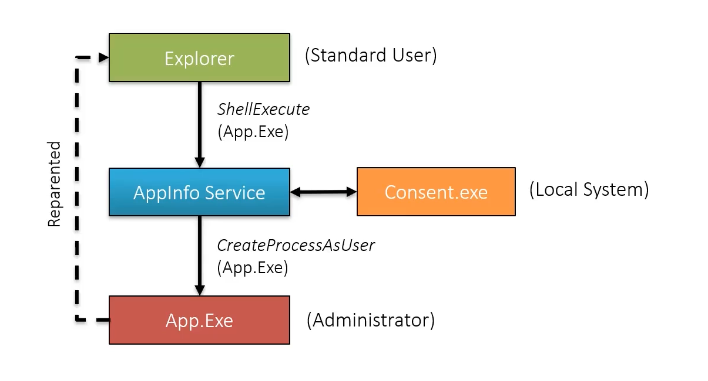

- When a user is authenticated, who is also an administrator, two tokens are created:
	- *Elevated Token*: Token with all the administrative privileges
	- *Filter Token*: Token with administrative privileges stripped. This token is used by default to create all the process.
- Ways to elevate privilege (use elevated token):
	- Right Click -> Run as Administrator 
	- Calling `ShellExecuteEx` API using the *runas* verb.
	- Add a manifest to the application asking for administrative privilege:
	```xml
	<trustInfo xmlns="urn:schema-microsoft-com:asm.v3">
		<security>
			<requestedPrivileges>
				# requires evevated token, cannot run with filter token
				<requestedExecutionLevel Level='requireAdministrator' />
				# if user can elevate, UAC dialog, if user is not admin, continue with user privs
				<requestedExecutionLevel Level='highestAvailable' /> 
			</requestedPrivileges>
		</security>
	</trustInfo>
	```
# Elevation Process

1. User opens explorer which is running as a standard user token.
2. When the user double clicks on an application which request administrator rights or the user selects "Run as Administrator", the `ShellExecute` API is called to execute *app.exe*.
3. `ShellExecute` calls a helper service *AppInfo Service*.
4. *AppInfo Service* brings up the *Consent.exe* which is the UAC box.
5. If the user is an administrator, the consent with ask a simple *Yes* or *No*. If the user is not an administrator, the consent will ask username and password of an administrator.
6. If everything works, the *consent.exe* will return the elevated token to the *AppInfo Service*. 
7. *AppInfo Service* will now run the App.exe with the the token returned by *consent* using the `CreateProcessAsUser`. [Access Token](Access%20Token.md)
8. Windows reparent the *App.exe* such that it looks like the process was spawned by *explorer.exe*
# AutoElevate
- Some processes can elevate themselves to *High Integrity Level* [Integrity Levels](Integrity%20Levels.md).
- Requirements:
	- Executable must be signed by Windows publisher.
	- Executable should be in a trusted directory, like *System32* or *Program Files*
	- AutoElevate should be set to true in application's manifest file. Can be verified with sigcheck
	```
	.\sigcheck.exe -m C:\Windows\System32\msconfig.exe
	```