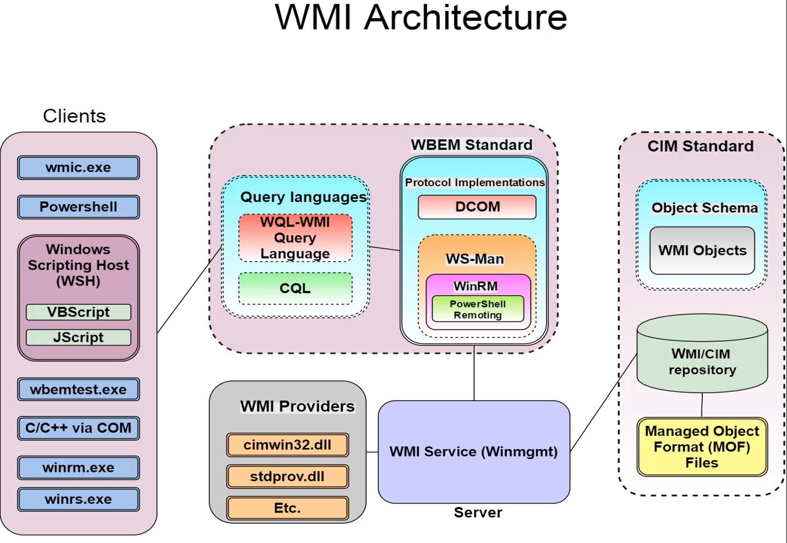
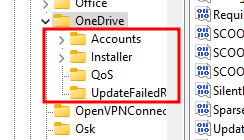
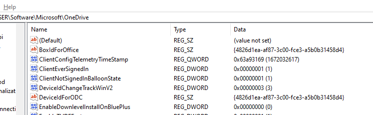

- Windows Management Instrumentation
- Microsoft's Implimentation of:
	- CIM: Common Information Model
	- WBEM: Web Based Enterprise Management
- Provides a uniform interface for applications/script to manage a local or remote computer or network
# Architecture


# Components
### MOF Files (managed object format)
- Defines WMI namespace, classes providers etc.
- Stored at `%WINDIR%\system32\wbem` with extention of `.mof`
### Providers
 - associated with every MOF file (not true for all `.mof` files)
 - eg. `filename.mof and filename.dll`
 - providers works as a bridge between a managed object and WMI. A providers main function is to provide access to classes.
### Managed Object
- Component that is being managed by WMI, could be process, service, operating system.
### Namespaces
- Created by providers.
- Used to divide classes logically
- Groups - 
	- System
	- Core
	- Extension
- Types - 
	- Abstract
	- Static
	- Dynamic
- Makes classes easy to discover and use
- Well Known Namespaces - 
	- `root\cimv2`
	- `root\default`
	- `root\security`
	- `root\subscription`
### Repository
- Database that is used to store definition of classes
- `%WINDIR\System32\wbem\Repository`
### Consumers
- Application of script that can be used to interact with WMI classes for query of data or run methods or to subscribe to events.
- Eg: Powershell,wmic.exe
# Interacting with Powershell
- WMI cmdlets
```powershell
PS C:\> Get-Command *wmi* -Type cmdlet | Select-Object -Property CommandType,Name

CommandType Name
----------- ----
     Cmdlet Get-WmiObject
     Cmdlet Invoke-WmiMethod
     Cmdlet Register-WmiEvent
     Cmdlet Remove-WmiObject
     Cmdlet Set-WmiInstance
```
- Up until Powershell version v2 we had only wmi commands
- From Powershell version v3, we have access to CIM cmdlets
### CIM
- Command Information Model
- Uses WS-MAN and CIM standards to manage objects.
- Can be used if WMI is blocked but WSMAN (WinRM) is enabled. 
- CIM is aligned to the standards of DMTF (Distributed Management Task Force) which means it can work with non-windows box as well.
NOTE: WMI is Windows oriented version of CIM
```powershell
PS C:\Users\drdragon> Get-Command *cim* -Type cmdlet | Select-Object -Property CommandType,Name

CommandType Name
----------- ----
     Cmdlet Get-CimAssociatedInstance
     Cmdlet Get-CimClass
     Cmdlet Get-CimInstance
     Cmdlet Get-CimSession
     Cmdlet Invoke-CimMethod
     Cmdlet New-CimInstance
     Cmdlet New-CimSession
     Cmdlet New-CimSessionOption
     Cmdlet Register-CimIndicationEvent
     Cmdlet Remove-CimInstance
     Cmdlet Remove-CimSession
     Cmdlet Set-CimInstance
```
# Namespace
- List available namespace by querying the `__Namespace` class
```powershell
# WMI
Get-WmiObject -Namespace root -Class __Namespace

# CIM
Get-CimInstance -Namespace root -ClassName __Namespace
```
- Every Namespace has class called `__Namespace` that can be used to query classes in that particular namespace.
- by default `root\CIMv2` is used to query class.
```powershell
# If we query a class without specifying namespace, "root\CIMv2 is used"
Get-WmiObject -Class Win32_Process
```
```powershell
# Recursive function to list all the Namespaces in the system.
function Get-WmiNamespace {
	param (
		$Namespace = 'root'
	)
	Get-WmiObject -Namespace $Namespace -Class __Namespace | forEach-Object {
		($ns = '{0}\{1}' -f $_.__Namespace,$_.Name)
		Get-WmiNamespace $ns
	}
}
```
# Classes
- Classes represents, process, harware, service etc.
### Categories 
- Core Classes: represents managed object that apply to all areas of management. Example - `__SystemSecurity` class
- Common Classes: Extension of core classes. for specific management areas. Prefixed with `CIM_` . Example - `CIM_UnitaryComputerSystem`
- Extended Classes: Technology specific addition to common classes. Example - `Win32_ComputerSystem`
### Types
- Abstract - Template Class used to define new classes. Cannot be used to retrieve instances.
- Static - Stores data like WMI configuration and operational data.
- Dynamic - Retrieved from a provider and represent a WMI managed object. Things like process, services and System.
- Association - Describes a relationship between two classes or managed resources
### Querying Classes with WMI
- Classes can be listed with `-List` option
```powershell
# List all classes in default "root\CIMv2" namespace
Get-WmiObject -List
Get-WmiObject -Class * -List

# Search class
Get-WmiObject -Class *bios* -List

# Search for specific classes in another namespace
Get-WmiObject -Namespace root\security -Class *bios* -List
```
### Querying Classes with CIM
```powershell
# List all classes in default "root\CIMv2" namespace
Get-CimClass

# Search for a class
Get-CimClass -Class *bios*

# List only dynamic classes, from which instances can be retrieved
Get-CimClass -QualifierName dynamic
```
# Objects
### Querying Objects with WMI
```powershell
# Lists all the instances of the class "Win32_BIOS"
Get-WmiObject -Class Win32_BIOS
```
### Querying Objects with CIM
```powershell
# Lists all the instances of the class "Win32_BIOS"
Get-CimInstance -ClassName Win32_BIOS
```
### Filtering Objects/Instances
1. `-Filter` Parameter
	```powershell
	-Filter "Name = 'explorer.exe'"
	```
2. `Where-Object` cmdlet (slower than `-Filter`)
	```powershell
	Where-Object {$_.name -eq "svchost.exe"}
	#OR
	Where-Object name -eq "svchost.exe"
	```
3. `-Query` Parameter
	```powershell
	# similar to sql
	-Query "select * from Win32_Process where Name = 'lsass.exe'"
	```
### Removing an Object
- We can use the `Remove-WmiObject` to remove the object returned by `Get-WmiObect`
```powershell
# This is equivalent to killing the process
Get-WmiObject -Class win32_process | Where-Object {$_.Name -Like "*notepad*"} | Remove-WmiObject
Get-CimInstance -Class win32_process | Where-Object {$_.Name -Like "*notepad*"} | Remove-CimInstance
```

# Methods
- Find all classes in a Namespace that has methods
```powershell
# WMI
Get-WmiObject -List | Where-Object {$_.Methods}

# CIM
Get-Cimclass -MethodName *
# Search for a specific class
Get-CimClass -MethodName create
```
- Listing Methods of a class
```powershell
# WMI
(Get-WmiObject -Class win32_process -List).Methods
Get-WmiObject -Class Win32_process -List | Select-Object -ExpandProperty Methods

# CIM
(Get-CimClass -Class Win32_process).CimClassMethods
Get-CimClass -Class Win32_process | Select-Object -ExpandProperty CimClassMethods
```
> [!NOTE]
> Mention of `static` in qualifiers indicates that the method is a static method. Can be called directly with Class without creating an object. For example `Create` is a static method, and can be called via class to create a process
- Listing paramters of a method
```powershell
Get-CimClass -ClassName win32_process | Select-Object -ExpandProperty CimClassMethods | Where-Object {$_.Name -like "Create"} | Select-Object -ExpandProperty Parameters
```
> [!NOTE]
> Qualifiers indicate if a parameter is input parmeter or output parmeter
- Executing Methods on an object
```powershell
# WMI
# Search for an object and store 
$calcObject = Get-WmiObject -Class Win32_process | Where-Object {$_.Name -like "calc.exe"}
# Call the object's method by passing the object and method.
Invoke-WmiMethod -InputObject $calcObject -Name Terminate

# CIM
$calcObject = Get-CimInstance -Class Win32_process | Where-Object {$_.Name -like "calc.exe"}
Invoke-CimMethod -InputObject $calcObject -MethodName Terminate
```

# Creating Objects
- `Invoke-WmiMethod` can be used to create objects (from static methods of a class).
```powershell
# Creating a win32_process object to create and object
#WMI
Invoke-WmiMethod -Class Win32_Process -Name Create -ArgumentList calc.exe
#CIM
Invoke-CimMethod -ClassName Win32_process -MethodName Create -Argument @{
CommandLine = "calc.exe"
}

```
# Modifying Objects
- `Set-WmiInstance` can be used to set writeable properties of a variable
- `Get-Writeable.ps1` can be used to get a list of writable properties of an object
```powershell
#WMI
Get-WmiObject -Class Win32_printer | Where-Object {$_.Name -like "*XPS*"} | Set-WmiInstance -Arguments @{
	Comments = "New Comment"
} 
#CIM
Get-CimInstance -ClassName Win32_printer | Where-Object {$_.Name -like "*XPS*"} | Set-CimInstance -Properties @{
	Comments = "New Comment"
} 
```
# Associators
- Relationship between WMI classes which is used to get information about object not avialable in single class.
- Class associations can be found here : https://raw.githubusercontent.com/dfinke/images/master/acn.png
- For Example there are three class that deals with network configurations:
	- Win32_NetworkAdapter
	- Win32_NetworkAdapterConfigrations
	- Win32_networkAdapterSettings
 - Associators can be used to gather information from all these class
 - `__RELPATH` property of the object can be used to map associators.
```powershell
# WMI
# Get-WmiObject -Query "Associators of {__RELPATH VALUE}"
# This lists out any object with the association
Get-WmiObject -Query "Associators of {Win32_NetworkAdapter.DeviceID=0}"

# To get only the list of associated class name we can run
Get-WmiObject -Query "Associators of {Win32_NetworkAdapter.DeviceID=0 where classDefsOnly}"

# CIM
Get-CimAssociatedInstance -InputObject (Get-CimInstance -Class Win32_NetworkAdapter -Filter "DeviceID = 0")
```
# References
- To get list of class that links two classes together i.e. the class that links a `class` and an `accociated` class, we can use `Reference of` WMI query to list the classes
```powershell
# list references objects
Get-WmiObject -Query "References of {Win32_NetworkAdapter.DeviceID=0}"
# list references class list only
Get-WmiObject -Query "References of {Win32_NetworkAdapter.DeviceID=0} where ClassDefsOnly"
```
# WMI Clients
### wmic
- Windows command line utlity by microsoft to manage wmi.
- wmic has been deprecated.
- Might not be mointored by Blue Team.
```powershell
# For interactive wmic session
wmic

# List help from interactive session
wmic:root\cli> /?

# list help about a namespace
wmic:root\cli>process /?

# non interactive use 
wmic process /?
```
### Other Clients:
- Sapient WMI explorer
- WMI Code Generator by Microsoft
- WMIGen.exe
- Wbemtest.exe
- Powershell WMI Browser
- .NET.System.Management Class
# Remote Computers
## WMI
- Uses DCOM on port 135 for establishing connection (default - `Winmgmgt` service)
- Admin privs are needed to access WMI on remote machines
- Supports `-ComputerName` parameter 
- Not firewall and NAT friendly.
- Data exchange is done on dynamics ports. The ports are configured by `HKEY_LOCAL_MACHINE\Software\Microsoft\Rpc\Internet`
```powershell
Get-WmiObject -Class Win32_BIOS -ComputerName 192.168.0.1 -Credential domain\username
```
## CIM
- Can use any of the following procol to connect to the remote machine through CIM Sessions
	- DCOM (Port 135) 
	- WinRM/WSMan (Port 5385/HTTP or 5286/HTTPS)
 - Admin Privs are required to connect to the machine
 - Supports `-ComputerName` parameter.
- WinRM/WSMan is firewall and NAT friendly
- If DCOM is blocked via firewall, WimRM can be used instead (if enabled)
- By default, WinRM/WSMan is used for connecting to the remote machine
```powershell
# Create a credential object
$username = "Administrator"
$password = "password"
$securepassword = ConvertTo-SecureString -Force -AsPlainText $password
$credential = [System.Management.Automation.PSCredential]::new($username,$securepassword)

# Create a session option if connecting with DCOM [OPTIONAL]
$sessionOption = New-CimSessionOption -Protocol DCOM

# Create a session
$session = New-CimSession -ComputerName 192.168.0.1 -Credential $credential -SessionOption $sessionOption

# Connect to the machine
Get-CimInstance -ClassName Win32_BIOS -Session $session
```
# Registry
- WMI can ineract with registry using `StdRegProv` class.
- The class `StdRegProv` resides in the `root\default` class.
- Provides a range of method on different Registry hives to retrieve keys and values, add, modify and remove keys and values.
- List the methods of the class:
```powershell
Get-WmiObject -Namespace root\default -Class StdRegProv -List | Select-Object -ExpandProperty Methods | Select-Object -Property Name

Name
----
CreateKey
DeleteKey
EnumKey
EnumValues
DeleteValue
SetDWORDValue
SetQWORDValue
GetDWORDValue
GetQWORDValue
SetStringValue
GetStringValue
SetMultiStringValue
GetMultiStringValue
SetExpandedStringValue
GetExpandedStringValue
SetBinaryValue
GetBinaryValue
CheckAccess
SetSecurityDescriptor
GetSecurityDescriptor
```
- Contants for Registry Hives :
	- `$HIVE_HKROOT` = 2147483648
	- `$HIVE_HKCU` = 2147483649
	- `$HIVE_HKLM` = 2147483650
	- `$HIVE_HKU` = 2147483651
 - Contants for data types:
	 - `$REG_SZ` = 1
	 - `$REG_EXPAND_SZ` = 2
	 - `$REG_BINARY` = 3
	 - `REG_DWORD` = 4
	 - `$REG_MULTI_SZ` = 7
	 - `$REG_QWORD` = 11
> [!NOTE]
> EnumKeys and EnumValues method has a vague definition in the case of registry and WMI.
> For Example:
> 	1. EnumKeys returns the following data for `software\Microsoft\OneDrive`

> 	2. EnumValues return the following data for `software\Microsoft\OneDrive`

- Query Keys within keys with `EnumKey`
```powershell
Invoke-WmiMethod -Namespace root\default -Class StdRegProv -Name EnumKey -ArgumentList @(2147483649,"Software\Microsoft\Internet Explorer\Toolbar") | Select-Object -ExpandProperty sNames
```
- Query Name within Keys with `EnumValues`
```powershell
Invoke-WmiMethod -Namespace root\default -Class StdRegProv -Name EnumValues -ArgumentList @(2147483649,"Software\Microsoft\Internet Explorer\TypedUrls") | Select-Object -ExpandProperty sNames
```
- Query Values within Names with `GetStringValue` , etc
```powershell
Invoke-WmiMethod -Namespace root\default -Class StdRegProv -Name GetStringValue -ArgumentList @(2147483649,"Software\Microsoft\Internet Explorer\TypedUrls","Url3") | Select-Object -ExpandProperty sValue
```
- Create or Modify a value with `SetStringValue` , etc
```powershell
Invoke-WmiMethod -Namespace root\default -Class StdRegProv -Name SetStringValue -ArgumentList @(2147483649,"Software\Microsoft\Internet Explorer\TypedUrls","ValueName","KeyName")
```